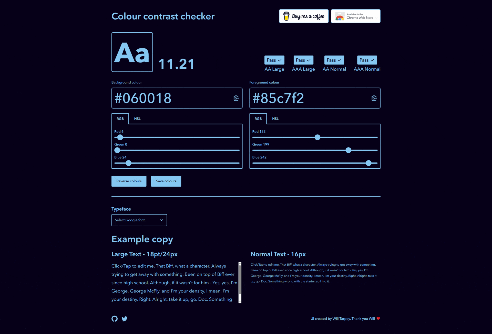
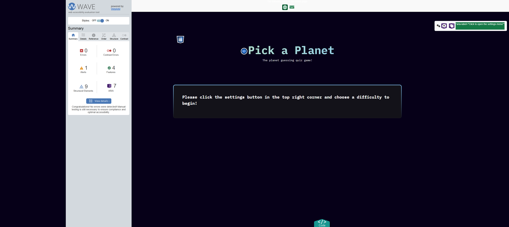
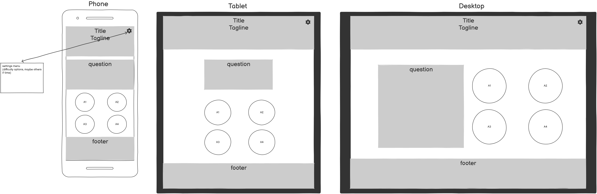
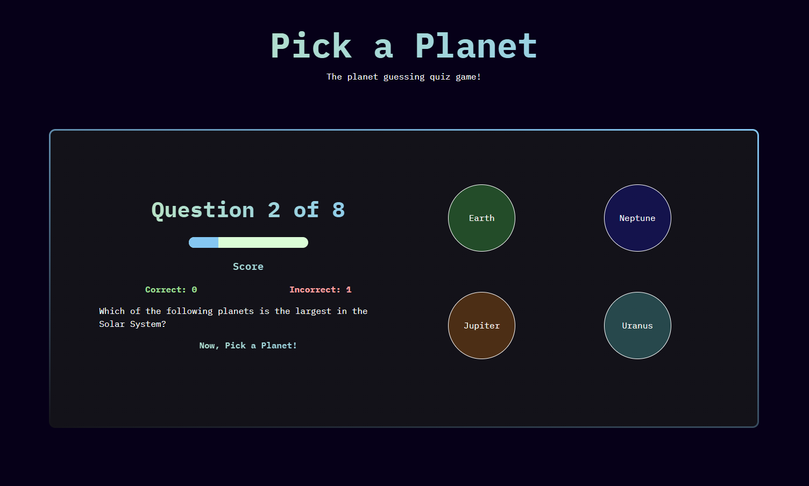
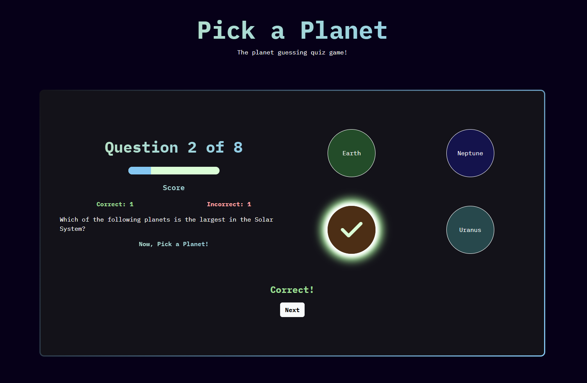
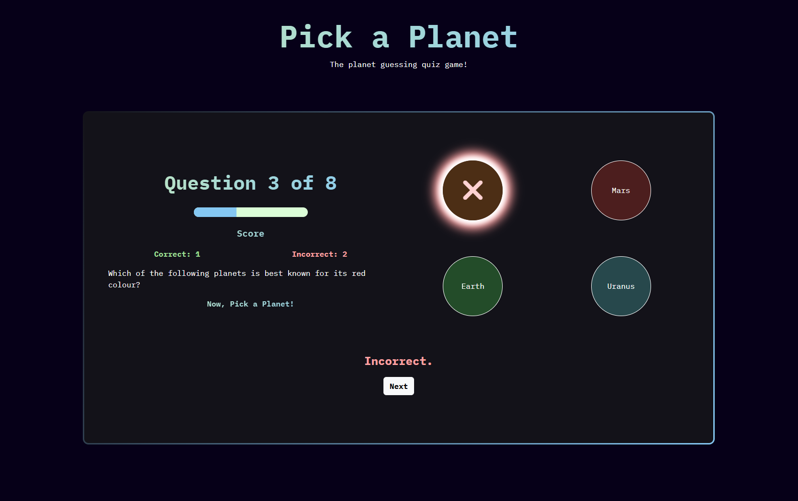
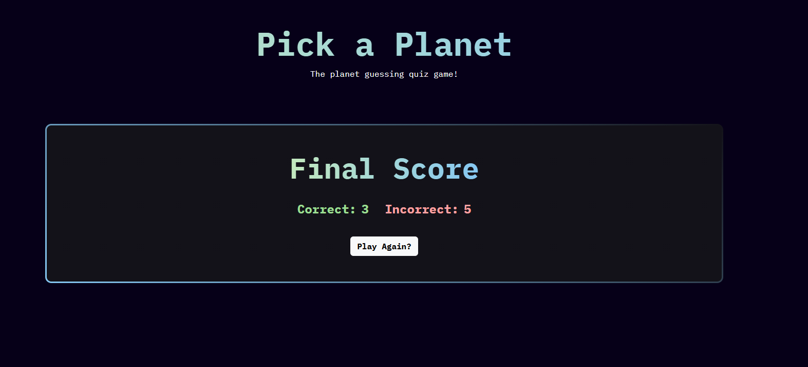
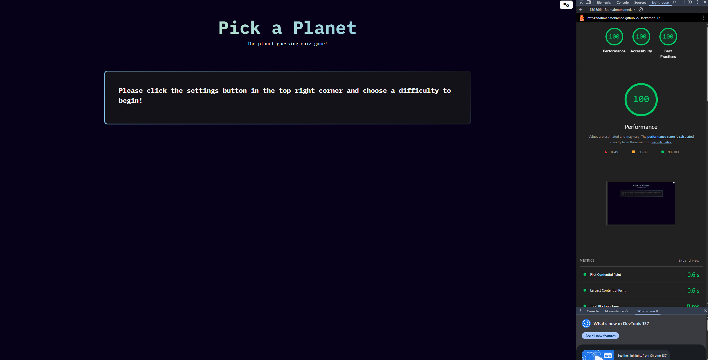

# Pick A Planet
  

| <a href="https://github.com/FatimahMohamed/Hackathon-1" target="_blank">Live Project</a> |

## Introduction
Pick a Planet is our first portfolio project, developed following the Code Institute Full Stack Development Bootcamp using HTML, CSS, Bootstrap and Javascript. It was developed following a set of guidelines,we had a choice of Quiz, Game or API catergories. 

## Project Outline
Pick a Planet was developed as a physics based quiz, to impart knowlege about the planets. General advice is given, a list of resources which should encompass people of all ages, and a form allowing the user to contact the website creators for questions. 

The website follows modern accessibility standards, and is responsive to devices of all screen sizes.

## Table of Contents
1. [Introduction](#introduction)
2. [Project Outline](#project-outline)
3. [UX Design](#ux-design)
   - [User Stories](#user-stories)
   - [Colours Used](#colours-used)
   - [Imagery and Theming](#imagery-and-theming)
   - [Font](#font)
   - [Wireframes](#wireframes)
   - [Features](#features)
4. [Deployment and Tools](#deployment-and-tools)
   - [Deployment](#deployment)
   - [Tools](#tools)
     - [Languages](#languages)
     - [Libraries and Frameworks](#libraries-and-frameworks)
5. [Testing and Validation](#testing-and-validation)
6. [AI Usage and Implementation](#ai-usage-and-implementation)
7. [References and Credits](#references-and-credits)

# UX Design
The UX design for "Pick a Planet" was focused on creating an engaging and intuitive experience for users of all ages, particularly younger audiences. The website features a modern layout with clear navigation, ensuring users can easily access instructions, play the quiz, and explore additional resources. Accessibility was a key priority, with high-contrast colors and responsive design to accommodate users on various devices and screen sizes. The quiz interface was designed to be simple yet interactive, providing instant feedback on answers and a score counter to track performance. By incorporating user stories and feedback, the design ensures a smooth and enjoyable experience while maintaining educational value.

## User Stories
### MUST HAVE:

#### User Story:
As a user, I would like clear instructions, so that I understand how to play the quiz. 
Acceptance Criteria: 
The webpage includes a set of instructions that are easy to understand. 
The instructions are easily accessible. 
Tasks: 
Create a set of clear, easy-to-understand instructions. 
Create a navbar with a link to the instructions.   

#### User Story:  
As a user, I would like the website to have good colour contrast so that I can read the text easily. 
Acceptance Criteria:
Text is easy to read against background. 
Background colour and font colour have good colour contrast.   
Tasks: 
Choose background colour and font colour that have a good colour contrast. 
Check contrast using a colour contrast checker website. 

#### User Story:  
As a user, I would like to test my Physics knowledge, so that I can assess my level of understanding. 
Acceptance Criteria: 
A set of Physics questions are available on the website. 
Users can get feedback on whether they have answered questions correctly. 
Tasks: 
Create a set of Physics questions to be displayed in the style of a quiz on the website. 
Display correct answers in green and incorrect answers in red so users get instant feedback after answering questions. 

#### User Story:  
As a user, I would like an intuitive interface so that I can navigate the page easily. 
Acceptance Criteria: 
The website is easy to navigate and not confusing. 
Tasks: 
Create a settings modal on the navbar. 
Include a next button which allows for easy navigation so users can answer the next question. 

#### User Story:  
As a user, I would like to have a score so that I know how I have performed. 
Acceptance Criteria: 
The user gets feedback on how many questions they have answered correctly. 
The user knows how many questions they have answered incorrectly. 
Tasks: 
Create a score counter which tallies the correct answers. 
Create a score counter which tallies the incorrect answers. 

#### User Story:  
As a user, I would like the website to have no obvious bugs so that I have a smooth user experience. 
Acceptance Criteria: 
The website has no bugs and user experience is smooth from the start of the quiz to the end. 
Tasks: 
Test the website by running through all levels of the quiz, making sure there are not bugs, including accurate score counting. 
Run HTML, CSS and Javascript through validators, ensuring all errors are rectified. 

### SHOULD HAVE:

#### User Story:  
As a user, I would like questions of varying levels of difficulty so that I can answer questions according to my degree of knowledge. 
Acceptance Criteria: 
Different levels of Physics questions are available. 
Level of questions are easy, medium and hard. 
Tasks: 
Create 3 sets of questions - beginner, medium, hard. 
Create a modal in the settings section which displays options to select easy, medium or hard questions. 

#### User Story:  
As a young person, I would like a modern layout so that I stay interested. 
Acceptance Criteria: 
Layout is modern and and not cluttered. 
Tasks: Ensure layout is modern and conforms to current design standards. 

### COULD HAVE:

#### User Story:  
As a teacher, I would like a set of questions so that I can assess my pupils' knowledge. 
Acceptance Criteria: 
A set of Physics questions is available, including questions from the National Curriculum. 
Tasks: 
Create and display a set of Physics questions from the National Curriculum. 

#### User Story:
As a student, I would like a set of questions so that I can prepare for my exams. 
Acceptance Criteria: 
A set of Physics questions is available, including questions from the National Curriculum. 
Tasks: 
Create and display a set of Physics questions from the National Curriculum. 

## Colours Used
- Rich Black `#060018`    
- Baby Blue`#85c7f2`
- Tea Green `#c3e8bd`
- Granny Smith Apple `#9cdd92`
- Salmon Pink `#ffa1a1`
- White `#ffffff`
- Grey `#131219`

We wanted a dark background so our blue and green font would stand out. It also can represent the nights sky and makes the webpage look modern.

All colours pass colour contrast checks.

## Accessibility

The website passes the [WAVE](https://chromewebstore.google.com/detail/wave-evaluation-tool/jbbplnpkjmmeebjpijfedlgcdilocofh) accessibility checker, and is responsive to all screen sizes.

## Imagery and Theming
The imagery and theming of the "Pick a Planet" website were carefully designed to align with the educational and interactive nature of the project. The planet theme was chosen to create a visually engaging experience while leveraging the expertise of the team in this subject area. The overall theme incorporates a modern aesthetic with a focus on accessibility, making the website appealing and functional for users of all ages.

## Font
We chose the font IBM Plex Mono from [Google Fonts](https://fonts.google.com/) for its modern look and clear readability. Titles are styled to stand out with larger sizes, higher font weights, and a subtle gradient in the text color. The body text maintains a clean and modern appearance, ensuring accessibility for users of all ages. The combination of fonts and styling complements the overall theme of the website, enhancing its professional and engaging design.

 ## Wireframes
 Wireframes were designed using [Balsamiq](https://balsamiq.com/). The final design of the website is slightly different than that of the wireframes as features were added during development.

 

##  Features
The "Pick a Planet" website offers an interactive physics-based quiz designed to educate users about the planets in an engaging way. The quiz displays one question at a time, requiring users to select an answer before proceeding to the next question. The website includes a running tally to track correct and incorrect answers, providing instant feedback to users. Additionally, the site is fully responsive, ensuring a seamless experience across devices of all screen sizes. Accessibility features, such as high-contrast colors and intuitive navigation, make the website user-friendly for individuals of all ages and abilities.

# Deployment and Tools

## Deployment
The "Pick a Planet" website was deployed using GitHub Pages, ensuring a reliable and accessible hosting solution. The deployment process involved pushing the validated and tested code to a GitHub repository and enabling GitHub Pages in the repository settings. This allowed the website to be hosted directly from the repository, making it easy to share and access. Regular updates to the repository ensure that the latest version of the website is always live.

## Tools
The development of the "Pick a Planet" website utilized a variety of tools to ensure efficiency and quality. The project was built using HTML5, CSS3, and JavaScript, providing a solid foundation for the website's structure, styling, and interactivity. Bootstrap was used as the primary framework to streamline responsive design and layout creation. Additional tools included Font Awesome for icons and Google Fonts for typography. Validation tools such as W3C Markup Validation and W3C CSS Validation were employed to ensure code quality, while Chrome DevTools Lighthouse was used to audit performance and accessibility.

### Languages

### Libraries and Frameworks

# Testing and Validation
We used W3C Markup Validation for HTML validation, W3C CSS Validation for our CSS validation. Used Chrome Dev Tools Lighthouse to audit the site for response time and accessibility.

The pictures are provided below.

# Ai Usage and Implementation

AI was only used in the readme for help with the syntax in the contents section. 

We decided against using AI code generation tools for the project for the learning experience of creating an interactive webpage from scratch. Debugging was completed manually during project creation, so no AI was necessary here. The website obtained full scores from Google's lighthouse tool, so AI was not needed for optimisation. No images were needed for the website, so AI was unnecessary here.

# References and Credits

- Project brief and learning materials by [Code Institute](https://codeinstitute.net/)
- Base code for Bootstrap components taken from [Bootstrap 5.3 Docs](https://getbootstrap.com/docs/5.3/getting-started/introduction/)
- Project created using [VSCode](https://code.visualstudio.com/)
- Best accessibility practices checked using [WAVE](https://chromewebstore.google.com/detail/wave-evaluation-tool/jbbplnpkjmmeebjpijfedlgcdilocofh)
- Favicon generated by [favicon.io](https://favicon.io/)
- Colour palette partially created with help from [Coolors](https://coolors.co/)
- README badges by [Shields.io](https://shields.io/badges/static-badge) and [Simple Icons](https://simpleicons.org/)

